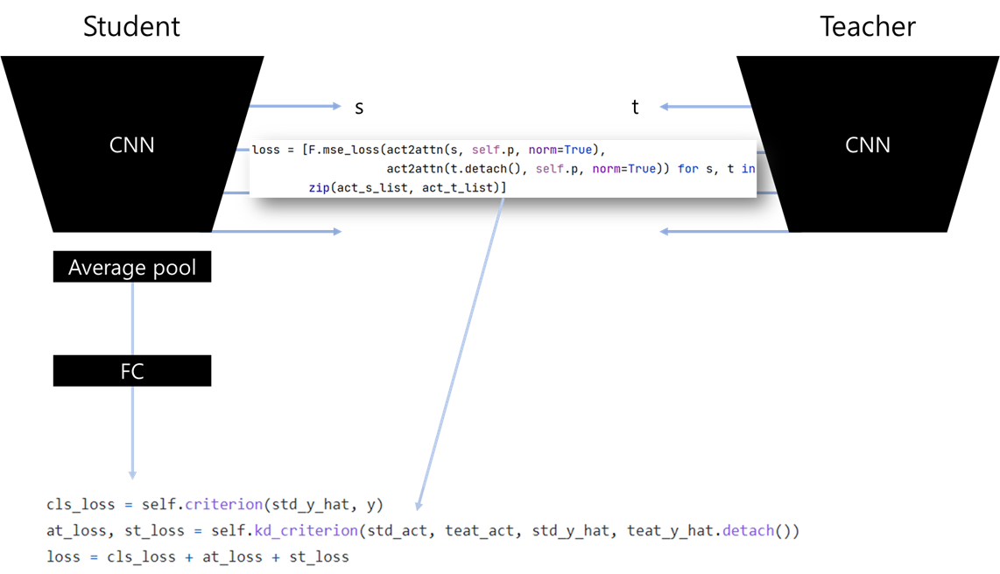

### AT Summary

### Train Result

ResNet20>>20/Cifar10 (91.9)

| no   | method | dataset | student      | teacher      | start_time          | acc         | epoch | nepoch | lr   | batch_size |
| ---- | ------ | ------- | ------------ | ------------ | ------------------- | ----------- | ----- | ------ | ---- | ---------- |
| 1    | at     | cifar10 | resnet_32_20 | resnet_32_20 | 2021-08-27/08-24-32 | 91.796875   | 119   | 200    | 0.1  | 128        |
| 2    | at     | cifar10 | resnet_32_20 | resnet_32_20 | 2021-08-27/10-25-36 | 92.15745544 | 165   | 200    | 0.1  | 128        |
| 3    | at     | cifar10 | resnet_32_20 | resnet_32_20 | 2021-08-27/12-29-20 | 91.7868576  | 159   | 200    | 0.1  | 128        |

ResNet20>>20/Cifar100 (68.4)

| no   | method | dataset  | student      | teacher      | start_time          | acc         | epoch | nepoch | lr   | batch_size |
| ---- | ------ | -------- | ------------ | ------------ | ------------------- | ----------- | ----- | ------ | ---- | ---------- |
| 1    | at     | cifar100 | resnet_32_20 | resnet_32_20 | 2021-08-27/08-24-33 | 68.47956848 | 154   | 200    | 0.1  | 128        |
| 2    | at     | cifar100 | resnet_32_20 | resnet_32_20 | 2021-08-27/10-26-07 | 67.94871521 | 155   | 200    | 0.1  | 128        |
| 3    | at     | cifar100 | resnet_32_20 | resnet_32_20 | 2021-08-27/12-29-51 | 68.7600174  | 159   | 200    | 0.1  | 128        |

ResNet110>>110/Cifar10 (93.3)

| no   | method | dataset | student       | teacher       | start_time          | acc      | epoch | nepoch | lr   | batch_size |
| ---- | ------ | ------- | ------------- | ------------- | ------------------- | -------- | ----- | ------ | ---- | ---------- |
| 1    | at     | cifar10 | resnet_32_110 | resnet_32_110 | 2021-08-27/08-24-35 | 93.20914 | 192   | 200    | 0.1  | 128        |
| 2    | at     | cifar10 | resnet_32_110 | resnet_32_110 | 2021-08-27/12-48-58 | 93.29928 | 115   | 200    | 0.1  | 128        |
| 3    | at     | cifar10 | resnet_32_110 | resnet_32_110 | 2021-08-27/17-00-49 | 93.40945 | 155   | 200    | 0.1  | 128        |

ResNet110>>110/Cifar100 (72.6)

| no   | method | dataset  | student       | teacher       | start_time          | acc      | epoch | nepoch | lr   | batch_size |
| ---- | ------ | -------- | ------------- | ------------- | ------------------- | -------- | ----- | ------ | ---- | ---------- |
| 1    | at     | cifar100 | resnet_32_110 | resnet_32_110 | 2021-08-27/08-24-35 | 72.66627 | 105   | 200    | 0.1  | 128        |
| 2    | at     | cifar100 | resnet_32_110 | resnet_32_110 | 2021-08-27/12-48-54 | 72.9968  | 162   | 200    | 0.1  | 128        |
| 3    | at     | cifar100 | resnet_32_110 | resnet_32_110 | 2021-08-27/17-00-43 | 72.27564 | 112   | 200    | 0.1  | 128        |

### References

- [szagoruko/attention-transfer](https://github.com/szagoruyko/attention-transfer)
- [2016, Paying More Attention to Attention: Improving the Performance of Convolutional Neural Networks via Attention Transfer(AT)](https://arxiv.org/abs/1612.03928)

