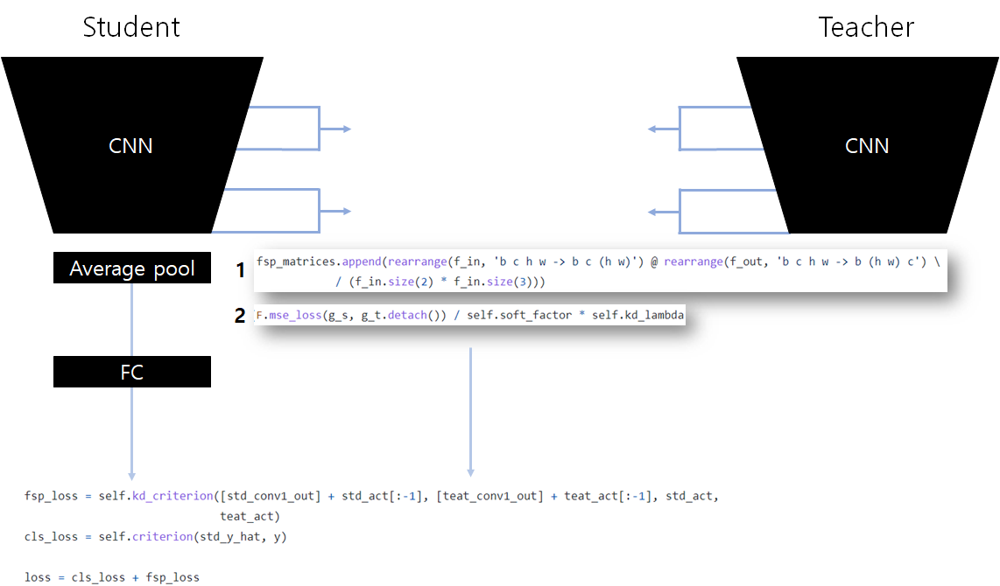

## FSP Summary

This method is really similar with Attention Transfer (AT). The only difference is how it process activation map before compare each other. The way of AT is just calculate mean of all activation map. But, in FSP, you should calculate fsp matrix first, which is inner product of two different dimensional matrix. If you are interested in how to compute fsp matrix, you can see code in below picture or go to original paper.

### Train Log

ResNet20>>20/Cifar10 (92.0)

| no   | method | dataset | student      | teacher      | start_time          | acc      | epoch | nepoch | lr   | batch_size |
| ---- | ------ | ------- | ------------ | ------------ | ------------------- | -------- | ----- | ------ | ---- | ---------- |
| 1    | fsp    | cifar10 | resnet_32_20 | resnet_32_20 | 2021-09-01/08-10-43 | 91.95713 | 195   | 200    | 0.1  | 128        |
| 2    | fsp    | cifar10 | resnet_32_20 | resnet_32_20 | 2021-09-01/08-59-09 | 91.89703 | 187   | 200    | 0.1  | 128        |
| 3    | fsp    | cifar10 | resnet_32_20 | resnet_32_20 | 2021-09-01/09-46-49 | 92.28766 | 193   | 200    | 0.1  | 128        |

ResNet20>>20/Cifar100 (68.0)

| no   | method | dataset  | student      | teacher      | start_time          | acc      | epoch | nepoch | lr   | batch_size |
| ---- | ------ | -------- | ------------ | ------------ | ------------------- | -------- | ----- | ------ | ---- | ---------- |
| 1    | fsp    | cifar100 | resnet_32_20 | resnet_32_20 | 2021-09-01/08-10-43 | 68.00881 | 126   | 200    | 0.1  | 128        |
| 2    | fsp    | cifar100 | resnet_32_20 | resnet_32_20 | 2021-09-01/08-57-06 | 67.96875 | 155   | 200    | 0.1  | 128        |
| 3    | fsp    | cifar100 | resnet_32_20 | resnet_32_20 | 2021-09-01/09-43-13 | 68.11899 | 166   | 200    | 0.1  | 128        |

ResNet110>>110/Cifar10 (92.7)

| no   | method | dataset | student       | teacher       | start_time          | acc      | epoch | nepoch | lr   | batch_size |
| ---- | ------ | ------- | ------------- | ------------- | ------------------- | -------- | ----- | ------ | ---- | ---------- |
| 1    | fsp    | cifar10 | resnet_32_110 | resnet_32_110 | 2021-09-01/08-10-44 | 92.19752 | 198   | 200    | 0.1  | 128        |
| 2    | fsp    | cifar10 | resnet_32_110 | resnet_32_110 | 2021-09-01/10-33-21 | 92.47797 | 172   | 200    | 0.1  | 128        |
| 3    | fsp    | cifar10 | resnet_32_110 | resnet_32_110 | 2021-09-01/12-32-53 | 93.46955 | 178   | 200    | 0.1  | 128        |

ResNet110>>110/Cifar100 (72.8)

| no   | method | dataset  | student       | teacher       | start_time          | acc      | epoch | nepoch | lr   | batch_size |
| ---- | ------ | -------- | ------------- | ------------- | ------------------- | -------- | ----- | ------ | ---- | ---------- |
| 1    | fsp    | cifar100 | resnet_32_110 | resnet_32_110 | 2021-09-01/08-10-44 | 73.27724 | 166   | 200    | 0.1  | 128        |
| 2    | fsp    | cifar100 | resnet_32_110 | resnet_32_110 | 2021-09-01/10-30-56 | 73.36739 | 167   | 200    | 0.1  | 128        |
| 3    | fsp    | cifar100 | resnet_32_110 | resnet_32_110 | 2021-09-01/12-29-02 | 71.90505 | 154   | 200    | 0.1  | 128        |

### Reference

- [2017, A Gift From Knowledge Distillation: Fast Optimization, Network Minimization and Transfer Learning](https://openaccess.thecvf.com/content_cvpr_2017/html/Yim_A_Gift_From_CVPR_2017_paper.html)