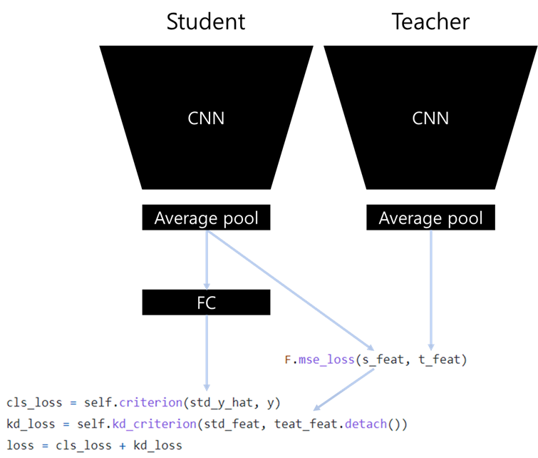

### Logit Summary

Logit Loss's loss computation looks like below pictures. No hyperparameter is required I think.

### Training Result

ResNet20>>20/Cifar10 (92.5)

| no   | method | dataset | student      | teacher      | start_time          | acc         | epoch | nepoch | lr   | batch_size |
| ---- | ------ | ------- | ------------ | ------------ | ------------------- | ----------- | ----- | ------ | ---- | ---------- |
| 1    | logit  | cifar10 | resnet_32_20 | resnet_32_20 | 2021-08-26/21-51-13 | 92.51802826 | 192   | 200    | 0.1  | 128        |
| 2    | logit  | cifar10 | resnet_32_20 | resnet_32_20 | 2021-08-26/22-46-34 | 92.4879837  | 197   | 200    | 0.1  | 128        |
| 3    | logit  | cifar10 | resnet_32_20 | resnet_32_20 | 2021-08-26/23-41-24 | 92.52804565 | 174   | 200    | 0.1  | 128        |

ResNet20>>20/Cifar100 (69.2)

| no   | method | dataset  | student      | teacher      | start_time          | acc         | epoch | nepoch | lr   | batch_size |
| ---- | ------ | -------- | ------------ | ------------ | ------------------- | ----------- | ----- | ------ | ---- | ---------- |
| 1    | logit  | cifar100 | resnet_32_20 | resnet_32_20 | 2021-08-26/21-51-13 | 69.26081848 | 161   | 200    | 0.1  | 128        |
| 2    | logit  | cifar100 | resnet_32_20 | resnet_32_20 | 2021-08-26/22-39-04 | 69.27083588 | 186   | 200    | 0.1  | 128        |
| 3    | logit  | cifar100 | resnet_32_20 | resnet_32_20 | 2021-08-26/23-26-25 | 69.10056305 | 164   | 200    | 0.1  | 128        |

ResNet110>>110/Cifar10 (94.2)

| no   | method | dataset | student       | teacher       | start_time          | acc      | epoch | nepoch | lr   | batch_size |
| ---- | ------ | ------- | ------------- | ------------- | ------------------- | -------- | ----- | ------ | ---- | ---------- |
| 1    | logit  | cifar10 | resnet_32_110 | resnet_32_110 | 2021-08-27/08-21-11 | 94.23077 | 199   | 200    | 0.1  | 128        |
| 2    | logit  | cifar10 | resnet_32_110 | resnet_32_110 | 2021-08-27/11-42-59 | 94.3109  | 182   | 200    | 0.1  | 128        |
| 3    | logit  | cifar10 | resnet_32_110 | resnet_32_110 | 2021-08-27/15-19-25 | 94.03045 | 170   | 200    | 0.1  | 128        |

ResNet110>>110/Cifar100 (71.8)

| no   | method | dataset  | student       | teacher       | start_time          | acc      | epoch | nepoch | lr   | batch_size |
| ---- | ------ | -------- | ------------- | ------------- | ------------------- | -------- | ----- | ------ | ---- | ---------- |
| 1    | logit  | cifar100 | resnet_32_110 | resnet_32_110 | 2021-08-27/08-21-11 | 72.49599 | 194   | 200    | 0.1  | 128        |
| 2    | logit  | cifar100 | resnet_32_110 | resnet_32_110 | 2021-08-27/14-43-11 | 71.40425 | 151   | 200    | 0.1  | 128        |
| 3    | logit  | cifar100 | resnet_32_110 | resnet_32_110 | 2021-08-27/18-19-31 | 71.42428 | 172   | 200    | 0.1  | 128        |

### References

- [2014, Do Deep Nets Really Need to be Deep(Logits)](https://arxiv.org/abs/1312.6184)

