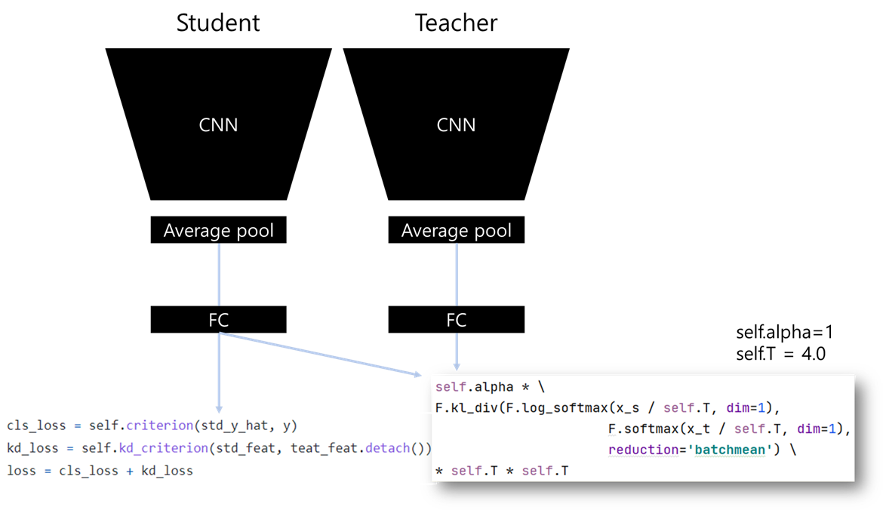

### ST Summary

### ST Train Result

ResNet20>>20/Cifar10 (92.8)

| no   | method | dataset | student      | teacher      | start_time          | acc         | epoch | nepoch | lr   | batch_size |
| ---- | ------ | ------- | ------------ | ------------ | ------------------- | ----------- | ----- | ------ | ---- | ---------- |
| 1    | st     | cifar10 | resnet_32_20 | resnet_32_20 | 2021-08-27/08-22-43 | 92.94872284 | 159   | 200    | 0.1  | 128        |
| 2    | st     | cifar10 | resnet_32_20 | resnet_32_20 | 2021-08-27/09-23-18 | 92.64823914 | 199   | 200    | 0.1  | 128        |
| 3    | st     | cifar10 | resnet_32_20 | resnet_32_20 | 2021-08-27/10-25-03 | 92.82852936 | 177   | 200    | 0.1  | 128        |

ResNet20>>20/Cifar100 (69.9)

| no   | method | dataset  | student      | teacher      | start_time          | acc         | epoch | nepoch | lr   | batch_size |
| ---- | ------ | -------- | ------------ | ------------ | ------------------- | ----------- | ----- | ------ | ---- | ---------- |
| 1    | st     | cifar100 | resnet_32_20 | resnet_32_20 | 2021-08-27/08-22-43 | 69.78165436 | 162   | 200    | 0.1  | 128        |
| 2    | st     | cifar100 | resnet_32_20 | resnet_32_20 | 2021-08-27/09-41-07 | 69.72155762 | 169   | 200    | 0.1  | 128        |
| 3    | st     | cifar100 | resnet_32_20 | resnet_32_20 | 2021-08-27/11-01-11 | 70.10216522 | 190   | 200    | 0.1  | 128        |

ResNet110>>110/Cifar10 (93.9)

| no   | method | dataset | student       | teacher       | start_time          | acc      | epoch | nepoch | lr   | batch_size |
| ---- | ------ | ------- | ------------- | ------------- | ------------------- | -------- | ----- | ------ | ---- | ---------- |
| 1    | st     | cifar10 | resnet_32_110 | resnet_32_110 | 2021-08-27/08-22-44 | 93.54968 | 158   | 200    | 0.1  | 128        |
| 2    | st     | cifar10 | resnet_32_110 | resnet_32_110 | 2021-08-27/15-09-43 | 94.16066 | 174   | 200    | 0.1  | 128        |

ResNet110>>110/Cifar100 (74.1)

| no   | method | dataset  | student       | teacher       | start_time          | acc      | epoch | nepoch | lr   | batch_size |
| ---- | ------ | -------- | ------------- | ------------- | ------------------- | -------- | ----- | ------ | ---- | ---------- |
| 1    | st     | cifar100 | resnet_32_110 | resnet_32_110 | 2021-08-27/08-22-43 | 74.15865 | 197   | 200    | 0.1  | 128        |
| 2    | st     | cifar100 | resnet_32_110 | resnet_32_110 | 2021-08-27/16-34-28 | 74.10857 | 118   | 200    | 0.1  | 128        |

